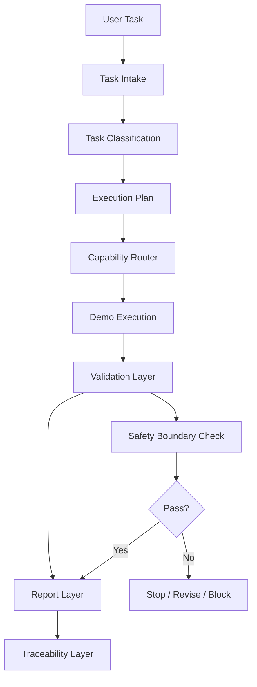

# Architecture

```text
User Task
  ↓
Task Intake
  ↓
Task Classification
  ↓
Execution Plan
  ↓
Capability Router
  ↓
Demo Execution
  ↓
Validation Layer
  ↓
Report Layer
  ↓
Traceability Layer
```

## Mermaid diagram



## Design principle

Make AI workflow decisions visible, reviewable, and safer before production use.
